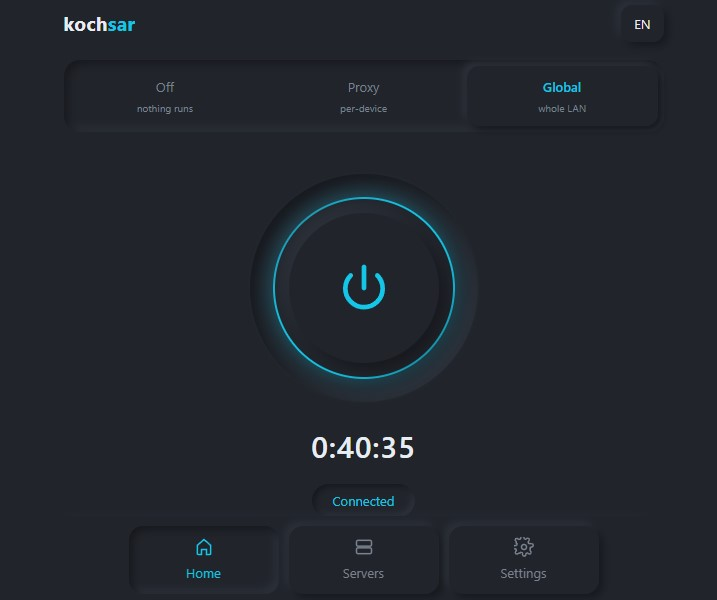

# kochsar panel

A transparent proxy manager for OpenWrt routers: one small Rust daemon, one fast browser panel, and your whole LAN through Xray.

[](LICENSE)
[](https://openwrt.org/)
[](https://www.rust-lang.org/)
[](#installation)

kochsar panel drives [Xray-core](https://github.com/XTLS/Xray-core) on your router so that every device in the
house goes through the tunnel without being configured one by one. It gives you a panel that behaves like
v2rayNG — paste a subscription, test the servers, tap the fastest one — except it runs on the router and covers
the whole network. It is a lightweight replacement for Passwall2: the same job, a fraction of the moving parts.

<p align="center">
  
</p>

## What you get

- **A panel that loads instantly.** Three tabs, a big power button, a server list. No LuCI, no page reloads.
- **Seven protocols, one core.** `vless`, `vmess`, `trojan`, `ss`, `hysteria2`, `wireguard` and `socks` —
  all of them running on the Xray your router already has, with no second core to install or feed.
  Transports: raw TCP (with HTTP disguise), WebSocket, gRPC, XHTTP and HTTPUpgrade; TLS and REALITY.
- **Subscriptions and share links.** Add a subscription URL and the servers arrive. Or paste links, one per
  line or as a base64 blob. Refreshing keeps your selection and your measured latencies.
- **Links that cannot work are refused when you add them,** with the reason — a Shadowsocks stream cipher, a
  VMess server still on `alterId`, REALITY over a transport it does not support. All of these are fatal to
  Xray, and since one config carries every server, one bad link would otherwise take the whole list down.
- **Honest latency testing.** Every server is measured by making a real HTTPS request *through* it, to a
  destination you choose (Google, YouTube, GitHub, Telegram, Instagram, Cloudflare, OpenAI, or your own URL).
  Two requests over one connection, and the warm one is reported — the same number v2rayNG shows, so the panel
  and your phone can be compared. One tap connects to the fastest.
- **Whole-LAN transparent proxying.** nftables TPROXY plus policy routing, so phones, TVs and consoles need no
  proxy settings at all.
- **DNS that actually goes through the tunnel.** A dnsmasq drop-in hands the LAN's queries to Xray, so names are
  resolved on the far side instead of by whatever is intercepting your connection. Presets for Cloudflare,
  Google, Quad9, AdGuard, Shecan, Electro, Begzar and Radar, or your own resolvers.
- **Three modes — `off`, `proxy`, `global`.** Off means the core is not running at all, so nothing this daemon
  does can take the router's internet down.
- **A confirm-or-revert safety window.** Turning on global mode arms a 90-second rollback. If the internet
  breaks, doing nothing fixes it.
- **A health watchdog.** A core that dies is restarted. A core that cannot be kept alive has its firewall rules
  torn down so the LAN falls back to a direct connection — and they are put back automatically when it recovers.
- **Automatic failover.** Optional: test every server on your own schedule and move to a clearly better one.
  Measurement never runs through the tunnel that is currently in use.
- **Bilingual.** English by default, Persian (RTL) one tap away. Soft-UI dark theme.
- **Light on the router.** A single static binary under 1 MB, no C toolchain, and a short dependency list. The
  whole stack measured **38.6 MB** of RAM against Passwall2's **51.2 MB** carrying the same traffic on the same
  router.

> **Status:** version 0.2.0. Transparent proxying, tunnelled DNS, crash recovery, a firmware upgrade, a reboot,
> the WAN-reconnect hook and the installer have all been exercised on a real router carrying a real LAN. What is
> not yet established is long-run behaviour under heavy use — treat this as an early release and keep SSH access
> handy.

### ⚠️ Tested on one device so far

Everything above was verified on exactly this hardware, and nowhere else yet:

| | |
|---|---|
| **Router** | Google WiFi — AC-1304 (board name `Gale`) |
| **SoC / target** | IPQ4019, ARMv7 rev 5 (v7l), 4 cores — OpenWrt target `ipq40xx/chromium` |
| **OpenWrt** | 25.12.2 (r32802-f505120278) |
| **Xray-core** | 26.3.27 (the version in OpenWrt's own feed) |
| **RAM** | 494 MB total |

The daemon discovers the router's own LAN interfaces, upstream resolver and dnsmasq layout at runtime rather
than hard-coding them, so other OpenWrt devices are expected to work — but expected is not verified. If you
run it on different hardware, please [open an issue](../../issues) and say what happened, whether it worked or
not. Reports are the only way this list grows.

## Requirements

| What | Details |
|---|---|
| **Router** | OpenWrt 22.03 or newer (anything using `fw4` / nftables). Developed on OpenWrt 25.12. |
| **Architecture** | `armv7` is the default release build and the only one tested. `aarch64`, `mipsel` and `x86_64` build from source with one command, but have not been run on real hardware yet. |
| **Free RAM** | About 64 MB free is comfortable; the whole stack measured 38.6 MB in use. |
| **xray-core** | Must already be installed: `apk add xray-core` on current OpenWrt, `opkg install xray-core` on older releases. |
| **curl** | Used to fetch subscriptions and to run the connection tests. Usually already present. |
| **dnsmasq** | Needed for tunnelled DNS in global mode. It is OpenWrt's default resolver, so it is normally running already. |
| **Kernel modules** | `kmod-nft-tproxy` and `kmod-nft-socket` for global mode: `apk add kmod-nft-tproxy kmod-nft-socket`. Proxy mode works without them. |
| **Flow offloading** | Must be **off** for global mode (Network → Firewall). It short-circuits the hooks interception relies on. |

The installer verifies the software prerequisites before it changes anything, and reports every problem at once
rather than failing halfway through with the service already enabled.

## Installation

Replace `ROUTER_IP` below with your router's address — usually `192.168.1.1`. If you have never used SSH,
follow [docs/INSTALL.md](docs/INSTALL.md) instead; it walks through the same steps much more slowly.

### The short version

**1. Download** the release tarball for your architecture from the Releases page, for example
`xrayop-0.2.0-armv7-unknown-linux-musleabihf.tar.gz`.

**2. Copy it to the router:**

```bash
scp -O xrayop-0.2.0-armv7-unknown-linux-musleabihf.tar.gz root@ROUTER_IP:/tmp/
```

> `-O` is not a typo. OpenWrt's SSH server (dropbear) ships without `sftp-server`, and modern `scp` uses SFTP by
> default — without `-O` you get a confusing "subsystem request failed" error. If `-O` is unavailable on your
> machine, pipe the file through SSH instead:
> `cat xrayop-*.tar.gz | ssh root@ROUTER_IP 'cat > /tmp/xrayop.tar.gz'`

**3. Extract and install, over SSH:**

```bash
ssh root@ROUTER_IP
cd /tmp
tar xzf xrayop-0.2.0-*.tar.gz
cd xrayop-0.2.0-*/
sh install.sh
```

The installer checks the router, installs the daemon and its service, enables it at boot, adds itself to
`/etc/sysupgrade.conf` so it survives a firmware upgrade, and finishes by printing something like:

```
  Panel:  http://ROUTER_IP:8088
  Token:  3f7a1c9e5b2d4086a1c7e93b5f0d2a48
```

**4. Open the panel** at `http://ROUTER_IP:8088` and paste that token when it asks. The browser remembers it.

If you missed the token, read it back on the router at any time:

```bash
logread | grep 'panel token' -A2
```

The first run comes up in **proxy mode**, which changes nothing about how your router routes traffic.

### Build it yourself

Every dependency is pure Rust, so a Linux host with `rustup` is the whole toolchain — no C cross-compiler, no
OpenWrt SDK:

```bash
rustup target add armv7-unknown-linux-musleabihf
cargo build --release --target armv7-unknown-linux-musleabihf
```

Other routers: `aarch64-unknown-linux-musl` for ARM64, `mipsel-unknown-linux-musl` for older MIPS devices,
`x86_64-unknown-linux-musl` for x86 boxes.

To produce an installable tarball like the released one:

```bash
./scripts/release.sh                                  # default target
TARGET=aarch64-unknown-linux-musl ./scripts/release.sh
```

`scripts/build.sh` (which `release.sh` calls) compiles on a remote Linux machine over SSH, which is how the
project is developed from a Windows workstation. Point it at your own host with `BUILDER=your-linux-host`, or
run `cargo build` directly if you are already on Linux.

Run the test suite with `cargo test` — 140 unit tests covering link parsing, subscription merge semantics,
config generation, the nftables ruleset, settings validation, the failover thresholds and the supervisor
lifecycle.

## First-time setup

Everything below happens in the panel.

**1. Add servers.** Settings → Subscriptions → paste the subscription URL → *Add and fetch*. Or Servers → *Add*
and paste `vless://` links directly. Mixed subscriptions are fine: unsupported link types are counted and
skipped rather than breaking the import.

**2. Test and pick one.** Servers → *Test all*. Each server is measured by a real request through it, so the
number means something. *Fastest* selects the best one for you.

**3. Choose a mode.** On the Home tab, tap `Proxy` or `Global`. Proxy is a good first step: point one device at
the router's SOCKS5 port (`1080`) or HTTP port (`1081`) and confirm the tunnel works before letting it near the
rest of the house.

**4. Turn on the whole LAN.** Tap `Global`. The panel warns you first, then:

- Xray is restarted with its TPROXY inbound listening.
- The nftables ruleset is validated against your kernel and loaded.
- dnsmasq is pointed at Xray for DNS.
- A **90-second countdown** appears.

**5. Confirm within the window.** Open a website on any device — a different tab, your phone, anything — and
check that the internet still works. Then press **"It works — keep"**.

This is the important part, so here is exactly what it does:

- Until you confirm, the change is **deliberately not saved to disk**. If the router drops off the network
  entirely, unplugging it and plugging it back in brings it up clean, with no interception at all.
- If you do not confirm in 90 seconds, a watchdog removes the firewall rules, hands DNS back to dnsmasq and
  restarts Xray without interception — automatically, with no action from you.
- Pressing **Revert** does the same thing immediately.
- Only after you confirm does global mode survive a reboot.

If a crash happens during that window, the rules can outlive the process — so on its next start the daemon looks
for rules it never confirmed and removes them, rather than leaving the LAN pointed at a port with nothing behind
it.

**Optional: the router's own traffic.** Settings → Transparent proxy → *Also tunnel the router's own traffic*.
Off by default, and worth understanding before you turn it on: with it on, a core that will not start costs the
router its own connectivity, not just the LAN's. Leave it off unless you specifically need the router's package
updates and time sync to go through the tunnel.

## Modes explained

| Mode | What it does | When to use it |
|---|---|---|
| **off** | Xray is not running at all. No proxy ports, no firewall rules, no DNS changes. The router routes exactly as it did before you installed anything. | Troubleshooting, or when you want the tunnel completely out of the way. Nothing this daemon does can affect your connection in this mode. |
| **proxy** | Xray runs with a SOCKS5 inbound on port `1080` and an HTTP inbound on `1081`. Nothing is intercepted — only clients you point at those ports use the tunnel. | Trying a new server, or when only a laptop and a phone need the tunnel. This is the mode a fresh install starts in. |
| **global** | Everything above, plus nftables TPROXY interception of LAN traffic and the LAN's DNS routed through the tunnel. Every device is covered with no client configuration. | Normal daily use, once you have confirmed a server works. |

Traffic to the router itself (SSH, LuCI, this panel), private address ranges, DHCP, multicast and the proxy
server's own address are never intercepted in any mode. IPv6 is left direct by default.

## Automatic failover

Off by default. Settings → Automatic failover → turn it on, and set:

- **Check every (minutes)** — how often every server is re-measured. Default 4 hours; anything from 5 minutes
  to a week is accepted. A failing tunnel triggers a check much sooner regardless: about three minutes of the
  connection not carrying traffic is enough.
- **The destination** — taken from Settings → Connection test. It is a real choice, not decoration: a server can
  reach Google perfectly and still fail on Instagram, so test against something you actually use.

Two things are worth knowing about how it decides:

**Measurement never runs through the tunnel in use.** A throwaway Xray instance is started with one local port
per server, each pinned to its own outbound, and every server is measured over the raw WAN connection at the
same time. Anything unrouted is dropped rather than leaking out directly. This means a failing active server
cannot drag the alternatives down and make itself look good.

**It does not chase the fastest number.** Latency to a distant server swings by hundreds of milliseconds between
measurements, and every switch drops live connections. So a working server is only replaced when the alternative
is clearly better on both counts — at least 35% faster *and* at least 250 ms faster — with a five-minute floor
between switches. A server that has stopped working, on the other hand, is replaced by anything that works.

## Uninstall

The uninstaller is in the release tarball you extracted:

```bash
ssh root@ROUTER_IP
cd /tmp/xrayop-0.2.0-*/
sh uninstall.sh            # keeps your server list and settings
sh uninstall.sh --purge    # removes those too
```

It removes things in the order that keeps the LAN online: firewall rules and policy routing first, then the DNS
hand-off back to dnsmasq, and only then the service itself. Reversing that order would leave the LAN redirected
at a port with nothing behind it. When it finishes it prints the router's nftables tables, a DNS lookup and an
internet check so you can see the router is back to normal.

If you deleted the extracted folder, download and extract the tarball again — or just run
`/etc/init.d/xrayop stop`, which already tears down every runtime change.

## How it works

For the curious. Nothing here is required reading.

**One daemon, one child.** `xrayopd` is a small HTTP server that owns an `xray` child process. It writes Xray's
config to `/var/etc/xrayop/config.json` (tmpfs, so config rewrites never touch the router's flash), validates
every candidate config with `xray run -test` before restarting, and keeps your servers and settings in
`/etc/xrayop/state.json` (mode `0600` — it contains credentials). The child is started with `PR_SET_PDEATHSIG`,
so even a SIGKILL of the daemon takes Xray down with it and never leaves an orphan holding the ports.

**Interception.** A dedicated nftables table, `inet xrayop`, separate from `fw4` so a firewall reload cannot
clobber it and so removing it is one precise command. Its base chain runs at `prerouting priority mangle - 1`,
ahead of fw4's own chains. Reading the interception chain top to bottom: reply packets of established flows
return first, then anything carrying Xray's own socket mark, then anything addressed to the router itself
(`fib daddr type local`), then the bypass sets — loopback, private ranges, DHCP's `0.0.0.0/8`, multicast and the
active server's resolved address. Only what survives all of that is marked and handed to Xray's TPROXY inbound
with `tproxy ip to :PORT`, which preserves the original destination so Xray knows where the client was going.

**Marks and routing.** Intercepted packets get mark `0x1ee` (494); an `ip rule` at priority 494 sends them to
routing table 494, which holds a `local default dev lo` entry so the kernel delivers them to the local TPROXY
socket instead of forwarding them. Xray stamps its own outbound sockets with mark `255`, which the interception
chain returns on — that, plus the reply rule and the server's address in the bypass set, is what stops the
tunnel eating its own traffic. None of these numbers collide with Passwall2's, so the two can coexist on disk
even though they must not intercept at the same time (kochsar refuses to apply its rules while Passwall2 is
actively intercepting, and says so).

**DNS.** Transparent proxying without DNS handling delivers a working tunnel to the wrong address: the client
resolves a name *before* the proxy sees anything, so a poisoned answer sends it somewhere else and the tunnel
faithfully connects there. So in global mode a single drop-in file, `zz-xrayop.conf`, is written into the
running dnsmasq's `conf-dir` (discovered by reading dnsmasq's actual command line, since the directory name
embeds a UCI section id that differs between routers). It sets `no-resolv` — without which dnsmasq keeps the
ISP's resolvers as extra upstreams and races them, a leak that looks like it works — and forwards everything to
Xray's DNS inbound on loopback. dnsmasq stays in front, so `.lan` names, DHCP hostnames and `/etc/hosts` keep
working. Each proxy server's own hostname gets a per-domain rule pointing at a directly-reachable resolver,
which breaks the otherwise perfect deadlock: dnsmasq's only upstream is Xray, Xray needs the tunnel to answer,
and the tunnel needs the server's address. The same rule files the answer straight into the nftables bypass set,
so a provider rotating an address does not silently start getting its own traffic intercepted. Port 53 is
explicitly excluded from the TPROXY chain and claimed by a redirect chain in the nat hook instead, which also
catches devices with a hardcoded public resolver. The drop-in lives on tmpfs, so a reboot removes it even if
nothing gets the chance to; the daemon puts it back at startup when the mode calls for it.

**The watchdog.** Xray is a child of this daemon, not of procd, so nothing outside the process would notice it
dying. Liveness is checked every 15 seconds and a dead core is restarted. If it cannot be kept running — four
consecutive failed restarts — the firewall rules and the DNS hand-off are removed so the LAN falls back to a
direct connection, and the panel says so plainly. Censored internet beats no internet, and it is recoverable
without physical access. When the core comes back, the rules go back with it. Separately, once a minute a real
request is made through the proxy; five consecutive failures restart the core, with a ten-minute cooldown
because that symptom also appears when the remote server is simply down.

**Resource containment.** Defaults chosen from documented router failures rather than guesswork: `connIdle` of
120 s (TPROXY UDP carries no close signal, so Xray holds one socket per flow until it expires — at Xray's stock
300 s a torrent client creates them faster than they are reclaimed), a `nofile` limit of 65536, a soft
`GOMEMLIMIT` of 96 MiB, Xray's access log off entirely, and file logging off by default with both a size cap and
an age cap when you turn it on. The log lives in RAM, so this matters.

**The panel's own security.** It is served by a root daemon that can rewrite the firewall, so `/api/*` is gated
three independent ways: a token generated from `/dev/urandom` on first run and compared in constant time; a
requirement that the `Host` header be an IP literal or `localhost`, which removes DNS rebinding as a technique
with nothing to configure; and an `Origin` check plus a strict `application/json` content-type requirement on
every mutating request, which stops a hostile web page driving the panel from a form post. Node listings never
include UUIDs or REALITY keys, and subscription URLs are never returned by the API — they usually embed a
per-user token that would yield the whole list, credentials included.

## Troubleshooting

**Everything stopped after a firmware upgrade.**
A sysupgrade wipes `/usr`. The installer lists its own files in `/etc/sysupgrade.conf`, so the daemon, your
server list and your settings come back — but the *core* may not. If `xray` was installed as a package,
attended sysupgrade rebuilds it into the new image; if it was placed by hand, nothing reinstalls it and you are
left with a daemon and no core. Check with `ls -l /usr/bin/xray`, and if it is gone:

```sh
apk add xray-core && /etc/init.d/xray disable && /etc/init.d/xrayop restart
```

The `disable` matters: the package ships its own service, and a second core started by procd would fight the
one `xrayopd` supervises. Installing from a package is worth preferring for exactly this reason — it survives
the next upgrade on its own. The boot symlink is also lost, so if the service does not come up by itself, run
`/etc/init.d/xrayop enable`. Nothing is broken meanwhile: with no core, no firewall rules are installed and the
LAN keeps a direct connection.

**The panel will not load.**
Check the service is up: `ssh root@ROUTER_IP 'ps | grep xrayopd; logread | grep xrayop | tail -20'`.
If you reach it by a name like `router.lan` you will get *"reach the panel by IP address, not by hostname"* —
that is deliberate anti-DNS-rebinding behaviour, so use the IP. If the port is in use, change it in
`/etc/config/xrayop` and run `/etc/init.d/xrayop restart`.

**It says the token is wrong.**
Read the current one on the router with `logread | grep 'panel token' -A2`, or straight from the state file:
`sed -n 's/.*"panel_token": "\([^"]*\)".*/\1/p' /etc/xrayop/state.json`. In the panel, Settings → About →
*Forget token* clears the stored one so you can paste it again.

**"xray exited" / the core will not start.**
The panel shows Xray's own reason on the status line — it is usually a malformed node, a wrong path to the
binary, or a port already taken. Turn on Settings → Logs briefly and press *View log*. On the router,
`xrayopd --check-config` asks Xray to validate the config it would run without touching anything that is
running. If the binary moved, set its path under Settings → Ports and binding (it must live in a system
directory such as `/usr/bin`).

**Global mode is on but nothing is intercepted.**
Three usual causes. *Flow offloading is enabled* — turn it off in Network → Firewall; it bypasses the hooks
interception uses. *The TPROXY kernel modules are missing* — `apk add kmod-nft-tproxy kmod-nft-socket`.
*Another proxy app is intercepting* — Passwall2, OpenClash and friends register chains at the same priority;
kochsar refuses to apply while Passwall2 is actively intercepting and tells you to run
`/etc/init.d/passwall2 stop`. To inspect the ruleset without applying anything: `xrayopd --dump-nft` prints it,
`xrayopd --check-nft` asks the kernel to validate it.

**The panel says "Enabled but the rules are gone from the kernel".**
Something flushed the table — nearly always an `fw4 reload` from a firewall change elsewhere in LuCI. Disable
and re-enable global mode from the panel to lay them down again.

**DNS stopped working on the LAN.**
Switch to `off` or `proxy` mode; the drop-in is removed and dnsmasq is restarted with its own upstreams. To do
it by hand over SSH:

```bash
rm -f /tmp/dnsmasq.*.d/zz-xrayop.conf /var/dnsmasq.*.d/zz-xrayop.conf
/etc/init.d/dnsmasq restart
```

**Firewall rules left behind after a crash or a power cut.**
The daemon looks for unconfirmed rules on startup and removes them, and `/etc/init.d/xrayop stop` takes down
everything it installed. If you need to do it manually:

```bash
nft delete table inet xrayop
ip -4 rule del fwmark 494 table 494
ip -4 route del local 0.0.0.0/0 dev lo table 494
```

**I locked myself out of the router.**
If it happened during the 90-second confirmation window, the setting was never saved: power-cycle the router and
it comes back with no interception. Otherwise, connect a cable to a LAN port and reach it at its LAN address —
traffic addressed to the router itself is never intercepted, so SSH and LuCI stay reachable by design.

## Safety and disclaimer

This software modifies your router's **firewall rules, policy routing and DNS configuration**, and it runs as
root. That is what a transparent proxy is; there is no version of this that does not. Everything is written to
be reversible, and the risky step is behind a confirm-or-revert window, but you should still read this before
you turn on global mode:

- Have a way back in. A LAN cable and the router's IP address is enough — the router itself is never
  intercepted — but knowing your device's reset procedure is cheaper than learning it under pressure.
- The first time you enable global mode, do it where you can physically reach the router.
- Nothing is persisted until you confirm. A power cycle during the confirmation window is a complete recovery.
- `sh uninstall.sh` returns the router to its previous state, and prints a DNS and internet check when it is
  done.

Provided as-is, with no warranty. See [LICENSE](LICENSE).

## Credits

- **[Xray-core](https://github.com/XTLS/Xray-core)** by Project XTLS — the proxy core this drives, and the
  reason any of this works.
- **[Passwall2](https://github.com/xiaorouji/openwrt-passwall2)** by xiaorouji — its `nftables.sh` and dnsmasq
  handling have been debugged against real routers for years. Nothing here is copied, but the non-obvious parts
  of the ruleset (base chain priority, explicit reply handling, socket matching being TCP-only, preserving the
  original destination in the tproxy statement) and the shape of the DNS deadlock fix came from reading it
  closely. Credit where it is due.
- **[v2rayNG](https://github.com/2dust/v2rayNG)** — the interaction model the panel is trying to match.
- **OpenWrt**, and the `tiny_http`, `serde`, `base64` and `percent-encoding` crates.

## License

MIT. See [LICENSE](LICENSE).
